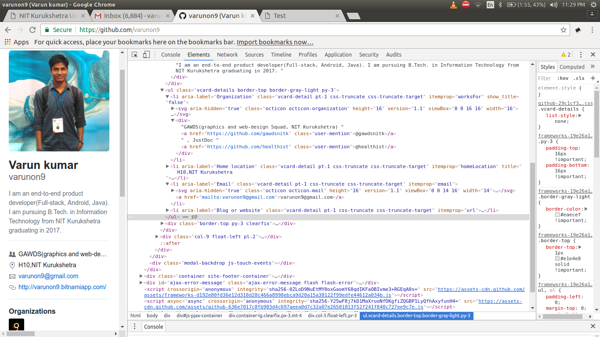
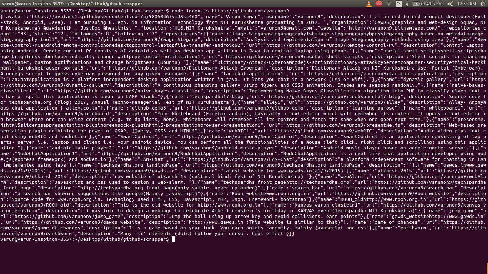

# Github Scraper
### A nodejs script (using cheerio module) to extract github users information and save to json file. 

Web scraping is an old way of sharing data between services. As per wikipedia, Web scraping (web harvesting or web
data extraction) is data scraping used for extracting data from websites. This script is a simple web scraper
which extracts basic information of any github user. 
Check https://github.com/varunon9/github-scraper/blob/master/data-beautify.json file to see extracted information.
Though github provides APIs for the same, I wrote this for learning purposes.

#### Dependencies
1. request: Helps us make HTTP calls
2. cheerio: Implementation of core jQuery specifically for the server (helps us traverse the DOM and extract data)
3. fs: Node File System (fs) module to implement file input/output

#### Screenshots

1. We need DOM details to extract informatio-  
2. Output on Console-  

#### Working
We have 3 steps in scraping-

1. We load the github profile of given user by making GET request (request module of nodejs)
2. Parse the HTML result (thanks to cheerio)
3. Extract the needed data

For step 3, we must know corresponding DOM elements in advance. You can check this using 'inspect elements' feature
of browser. Visit github profile of any user and inspect elements by right click or pressing `ctrl + shift + I`.
You can also see source code. See screenshot 1. Read index.js file for more details. Note that **script will
no longer work once github changes its DOM elements.** However you will have the idea and can re-write script.

##### How to execute this script?
1. To execute this script you must have nodejs installed.
2. Download zip file (or make git clone) and extract to hard disk
3. Open terminal/cmd
4. Move to script directory (where you extracted zip file) using `cd /path/to/repository`
5. Run `npm install` to install all nodejs dependencies
6. Once all the dependencies has been installed type `node index.js <url>`
7. Replace <url> with url of github user (of which you want to extract information) e.g. https://github.com/varunon9
8. Depending on your internet speed it will take some time. You can see output on screen once finished.
9. script also write this data to hard-disk. Check user.json file in this directory.
10. You will have to beautify json data to make it readable. You can visit https://jsonformatter.curiousconcept.com/
11. You can check data-beautify.json which is extracted data after beautification.
